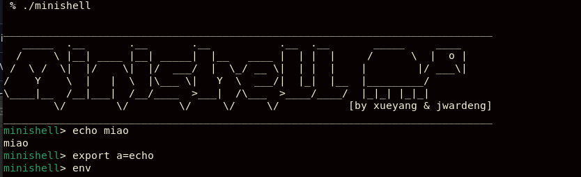
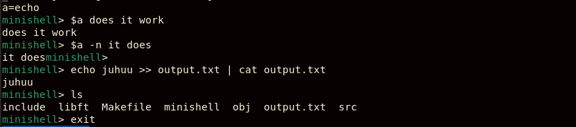

# MiniShell 🐢

Minishell is a simplified Unix shell implemented in C. It replicates fundamental features of shells like bash. 

Objectives:
Reproduce the behavior of a basic shell |
Learn about process creation, file descriptors, pipes, and signals |
Handle user input, parsing, and tokenization using AST (abstract syntax tree) |
Manage environment variables and built-in commands


## Usage

Use the Makefile to compile:
```javascript
make
```

Start the shell:
```javascript
./minishell
```
Now you can play around and use the shell, for example:





## Authors

- [@Joana Wardenga](https://www.github.com/YunShenMiao) 🐢

